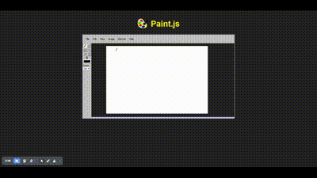

# Paint.js

**paint.js** es una aplicación web que imita la clásica aplicación de Paint de Windows, desarrollada completamente con Vanilla JavaScript. Todo el código está contenido en un único archivo `index.html`.

## Características

- Dibujo libre con el ratón.
- Selección de colores.
- Diferentes tamaños de pincel.
- Borrador.

## Instalación

No se requiere instalación. Simplemente clona este repositorio y abre el archivo `index.html` en tu navegador.

```bash
git clone https://github.com/tu-usuario/paint.js.git
cd paint.js
open index.html
```

## Uso

1. Abre `index.html` en tu navegador.
2. Usa el ratón para dibujar en el lienzo.
3. Selecciona colores y tamaños de pincel desde la interfaz.
4. Usa el borrador para corregir errores.

## Video de demostración


## Contribuciones

¡Las contribuciones son bienvenidas! Si tienes ideas para mejorar la aplicación, por favor abre un issue o envía un pull request.


